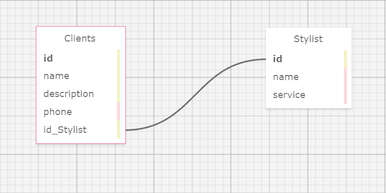

# _MySql Database Basics_

#### By: _*Peter Philavanh*_

### Eau Claire's Hair Salon

## Technologies Used

* _VS Code_
* _C#_
* _.NET 6.0_
* _MySql_
* _Entity Framework Core v6.0.0_
* _ASP.Net Core MVC_

## Description
_This web application was created for a code review at Epicodus. It allows the user of "Eau Claire's Salon to add stylists with subsequent information and clients with thier subsequent information as well as associating a specific stylist to each client. The user is able to edit or delete both clients or stylists._

## Schema
_The image shows the relationship of two tables within the schema of the database for this project_

## Setup/Installation Requirements

* _Clone this repository to your local machine_
* _Navigate to the project file and open file to your editor of choice_
* _Open MySql workbench; Note: if MySql workbench is not install onto your local machine follow this link [MySql](https://www.learnhowtoprogram.com/c-and-net-part-time/getting-started-with-c/installing-and-configuring-mysql) for step-by-step instructions on how to do so_
* _Once installed, create your own schema using the data from `peter_philavanh.sql` and import this data to your MySql workbench_
* _add `.gitignore` to the main root directory, add `obj`, `bin`, and `appsettings.json` within the .gitinore. Git commit changes_
* _Change directories by entering `$ cd HairSalon/` and create a new file `$ touch appsettings.json`_
* _Inside appsettings.json file, add [apssettings](appsettings_img.png) changing the database to the name of the database you created earlier, UID for your user workbench id, and pwd for your password_
* _Enter `$ dotnet add package Microsoft.EntityFrameWorkCore -v 6.0.0` and `$ dotnet add package Pomelo.EntityFrameWorkCore.MySql -v 6.0.0` to install necessary _
* _Enter `dotnet build` to install all obj and bin files_
* _Enter `dotnet run` to start local host server_
* _If browser does not open automatically to the splash page, enter the url http://localhost:5000/ into your browser_

## Known Bugs

* _No known bugs at this time_
* _Please report any issues to efl2ice89@gmail.com_

## Licensing
This is licensed under the [MIT](https://opensource.org/licenses) license
Copyright (c) December 2022 Peter Philavanh